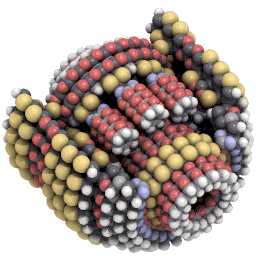
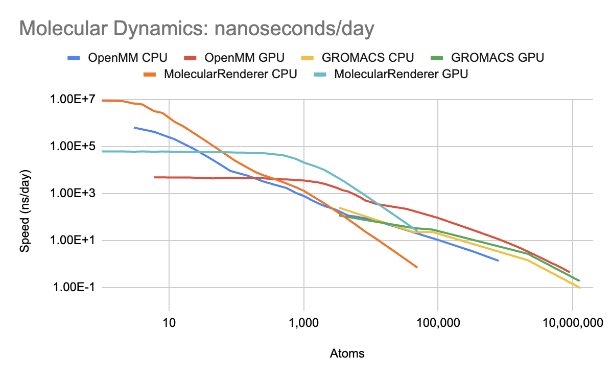
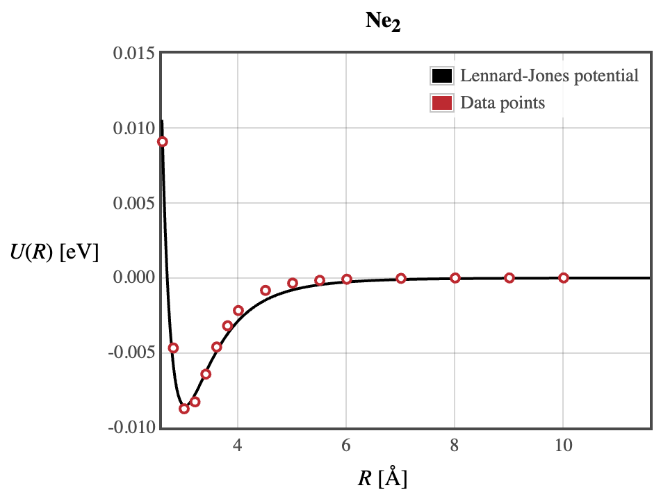
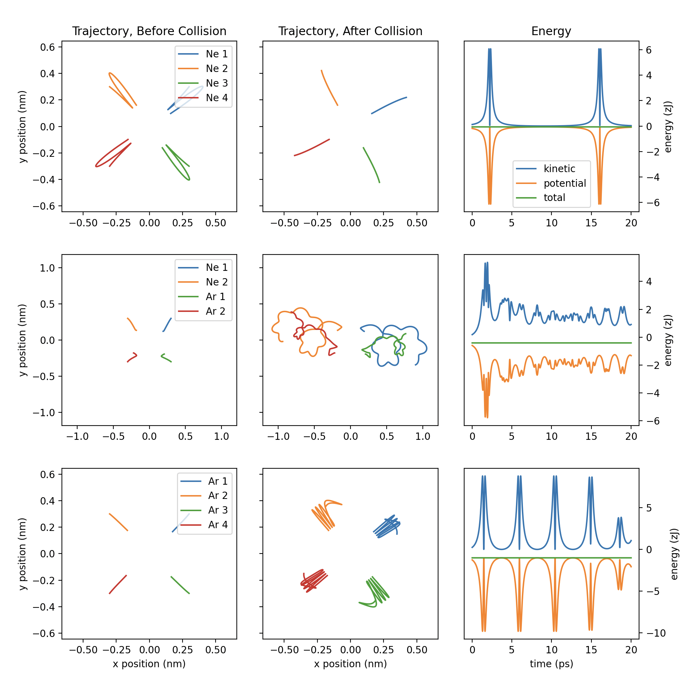
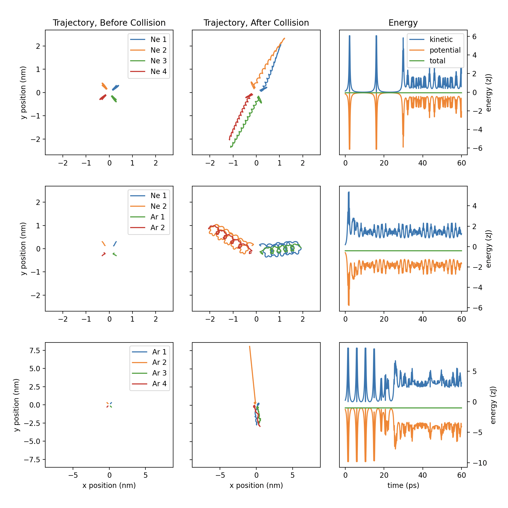

# Characterization of Noble Gas Dimers via Molecular Dynamics Simulation

Philip Turner

<i>Virginia Tech, MATH 2406, May 8, 2023</i>

## Introduction

Molecular dynamics (MD) is a type of physics simulation that examines the interactions between individual atoms and molecules. It is used widely in chemistry, materials science, and molecular nanotechnology to understand phenomena that are difficult to measure experimentally. One example is the testing of atomically precise gears and bearings (Fig. 1), which cannot be manufactured with current technology[^1]. MD reveals how the forces present at the atomic scale create unique design constraints, which differ from macroscale mechanical engineering.

There are numerous software libraries for molecular dynamics, each specializing in simulating a different type of molecule. The fastest library for simulating on personal computers is OpenMM[^2], due to utilization of graphics hardware with massive computational power. However, calling into an external library incurs non-negligible overhead, becoming a bottleneck for very small systems. This research paper details the creation of a new simulation program, which outperforms existing libraries for systems with under 10,000 atoms (Fig. 2). The program only supports a single type of interaction between atoms, limiting its applicability to noble gases. Future improvements can extend support to other elements such as carbon and hydrogen.

<i> <b>Figure 1.</b> A working planetary gear built out of individual atoms, tested using molecular dynamics. </i>

<i> <b>Figure 2.</b> Simulation speed of various molecular dynamics libraries when the timestep is 4 fs. OpenMM (blue, red) is faster than all other libraries for 10,000 - 1 million atoms. The orange and cyan lines are the Swift code developed for this research paper. The code utilizes SIMD parallelism to achieve $O(n)$ scaling between 1 - 8 atoms, then faces $O(n^2)$ scaling until 70 atoms. Next, it switches to GPU acceleration and becomes $O(1)$ - bottlenecked by latency. At 10,000 atoms, the Swift code becomes slower than OpenMM.</i>

## Methods

In molecular dynamics, each atom exerts a force on other atoms. Over time, that force causes atoms to move. To simulate this on a computer, one can use Euler's method. Each particle has a velocity, and it moves according to that velocity for a short time interval. After the time interval is finished, the velocity is recalculated. Euler's method is a type of numerical integrator, which finds how a system evolves over time. However, this integrator does not conserve energy. Small numerical errors compound during each time step, and generally increase the energy (Eqn. 1). Therefore, MD employs symplectic integrators, which are designed to conserve energy. My project will use the velocity Verlet integrator (Eqn. 2).

A system has two particles with equal mass and velocity.

$m_1 = m_2 = m$

$v_1 = v_2 = v$

$E_{correct} = \frac{1}{2}m_1v_1^2 + \frac{1}{2}m_2v_2^2 = \frac{1}{2}mv^2 + \frac{1}{2}mv^2 = mv^2$

$E_{approximate} = \frac{1}{2}m(0.99v)^2 + \frac{1}{2}m(1.01v)^2 = 1.0001mv^2$

<i> <b>Equation 1.</b> Assuming numerical error in the velocity has a standard deviation of ±0.01, energy systematically trends toward greater values. Note that the velocities themselves are not systematically increasing; the random deviations have a mean of zero. The energy increases slightly each time step, and explodes after many time steps. </i>

1) Update positions: 
  $x_1(t+h) = x(t) + hx_i'(t) + \frac{1}{2}h^2x_i''(t)$ 

2) Compute forces: 
 $(f_1,f_2,...f_n) = F(x_1,x_2,...x_n)$ 

3) Update accelerations: 
 $x_i''(t+h) = f_i / m$ 

4) Update velocities: 
 $x_i'(t+h) = x_i'(t) + \frac{1}{2}h(x_i''(t) + x_i''(t_h))$ 

<i> <b>Equation 2.</b> The velocity Verlet integrator. $F$ represents the forcefield, which determines forces as a function of atom positions. $x_i$ is the position vector of a single particle with index $i$. Newton's second law transforms the forces into accelerations, which are second derivatives of position. </i>

Potential energy surfaces are multivariable functions that map atom positions (the domain) to potential energy (the range). Systems tend to migrate toward places of lower potential energy (local minima), the lowest of which is the equilibrium. A system migrates faster when the potential energy slope is steeper. In other words, the forces on atoms are proportional to the potential gradient (Eqn. 3). If the kinetic energy is great enough, atoms can occasionally ascend the slope and jump to higher local minima. This is how molecules cross large energy barriers needed for chemical reactions.

Forcefields are algorithms that approximate the true potential energy surface. They follow the Born-Oppenheimer approximation, which assumes that electrons move instantaneously to match the position of nuclei. This approximation breaks down when two energy states become extremely close[^3]. Forcefields calculate "bonded forces" between atoms connected by a covalent bond, which are often very complex math functions. They also calculate "nonbonded forces" between every pair of atoms in the scene, which are summed to create a net force. The latter scales $O(n^2)$ with the number of atoms and dominates compute cost. Smarter algorithms reduce the complexity to $O(n)$, but only apply to systems much larger than I will simulate.

$\vec{F}(x,y,z) = -\nabla U = (-\frac{\partial U}{\partial x}, -\frac{\partial U}{\partial y}, -\frac{\partial U}{\partial z})^T$

<i> <b>Equation 3.</b> Force is the negative gradient of potential energy ($U$) with respect to position. Atoms follow a path of steepest descent as the system evolves. </i>

$U(r) = 4\epsilon \left[(\frac{\sigma}{r})^{12} - (\frac{\sigma}{r})^{6}\right]$

$F(r) = 48\epsilon \left[\frac{\sigma^{12}}{r^{13}} - 0.5\frac{\sigma^6}{r^7}\right]$

<i> <b>Equation 4.</b> Formula for the van der Waals potential energy. $r$ is the distance between both atoms, analogous to a circle's diameter (twice the radius). $\epsilon$ is the absolute value of the lowest potential energy (which is negative) and $\sigma$ is the distance where $U = 0$. </i>

A common nonbonded force is the Lennard-Jones (LJ) potential (Eqn. 4). This force simulates the van der Waals interaction, where two atoms' electron clouds spontaneously polarize in a way that attracts the atoms. When the atoms become too close, the attraction inverts and becomes repulsive. At the "van der Waals radius", the atoms reach a potential energy minimum. This creates a potential energy surface with a steep downward slope (repulsive force) at short distances and a mild upward slope (attractive force) at long distances (Fig. 3).

The formula is parameterized by two constants $\sigma$ and $\epsilon$, which vary based on the identity of the two atoms interacting. Parameters for atoms of the same element were compiled from quantum chemistry simulations[^4], but parameters for two different elements had to be found another way. A common heuristic is to take the arithmetic mean of distance and the geometric mean of energy (Eqn. 5). However, the Waldman-Hagler rule provides more accurate parameters for noble gases[^5]. My project will use the latter heuristic. Energies for He-Ar and He-Kr seem abnormally low, decreasing from left to right across the table (Fig. 5). This may indicate that the formula is breaking down and producing nonphysical numbers.

&nbsp;
  
&nbsp; &nbsp;
  
  &nbsp;

<i> <b>Figure 3.</b> Potential energy surfaces for vdW interactions between neon-neon and argon-argon pairs[^4]. Å is a unit equivalent to 0.1 nanometers. The global minimum is -0.009 eV for neon and -0.014 eV for argon. </i>

| Element | $\sigma$ (nm = 10-9 meters) | $\epsilon$ (meV = 10-3 electron-V) |  $\epsilon$ (zJ = 10-21 joules) |
| --- | --- | --- | --- |
| He | 0.2411 nm | 4.570 meV | 0.732 zJ |
| Ne | 0.2687 nm | 8.56 meV | 1.371 zJ |
| Ar | 0.3425 nm | 13.66 meV | 2.189 zJ |
| Kr | 0.3698 nm | 18.2 meV | 2.916 zJ |

<i> <b>Figure 4.</b> LJ parameters for interactions with other atoms of the same element. eV quantities are converted to SI units (joules) for consistency with other formulas.</i>

$\sigma_{ij} = (\sigma_{ii} + \sigma_{jj}) / 2$

$\epsilon_{ij} = \sqrt{\epsilon_{ii} \epsilon_{jj}}$

<i> <b>Equation 5.</b> Simplified method for deriving vdW parameters between two elements $i$ and $j$. </i>

| Element | He | Ne | Ar | Kr |
| --- | --- | --- | --- | --- |
| He | 0.732 zJ | 0.951 zJ | 0.787 zJ | 0.752 zJ |
| Ne |          | 1.371 zJ | 1.357 zJ | 1.337 zJ |
| Ar |          |          | 2.189 zJ | 2.461 zJ |
| Kr |          |          |          | 2.916 zJ |

<i> <b>Figure 5.</b> vdW energies using the Waldman-Hagler rule. </i>

Before running the simulation, one needs to choose the time step. Truncation error of the velocity Verlet integrator scales with $O(h^2)$, so doubling the time step leads to 4x error. However, the end goal is to run an MD simulation as fast as possible. Using larger time steps means the simulation can finish more quickly. A standard practice is setting the time step to $\frac{1}{10}$ the duration of the highest-frequency motions you want to capture[^6]. For example, carbon-hydrogen bonds vibrate with a period of 11 fs, so timesteps are typically ~1.1 fs (femtosecond; 10-15 seconds). The van der Waals attraction between noble gas atoms has a vibrational period of ~1000 fs, several orders of magnitude higher (Eqn. 6, Fig. 6). I will stick with a conservative 1 fs timestep, but 100 fs could theoretically work as well.

$r_0 = 2^{1/6} \sigma$

$k_{approx} = 2\epsilon(\frac{6}{r_0})^2 = \frac{57.146\epsilon}{\sigma^2}$

<i> <b>Equation 6.</b> An atom pair is modeled as a spring-mass system undergoing harmonic oscillation. Above is the formula for approximating $k$, the spring stiffness in N/m[^7]. $\sigma$ and $\epsilon$ are parameters from the LJ potential. </i>

| Atom Pair | $k_{approx}$ | $\mu = \frac{1}{1/m_1 + 1/m_2}$ | $T = 2\pi\sqrt{\mu/k}$ |
| --- | --- | --- | --- |
| Ne-Ne | 1.085 N/m | 1.675E-26 kg |  781 fs |
| Ne-Ar | 0.777 N/m | 2.226E-26 kg | 1064 fs |
| Ar-Ar | 1.066 N/m | 3.317E-26 kg | 1108 fs |

<i> <b>Figure 6.</b> Derivation of the vibration period for elements that will be simulated. fs is a unit equivalent to 10-15 seconds.</i>

In some simulations, the primary goal is to observe how changes in the system affect energy. Molecules can release energy after forming strong bonds, which manifests as heat and can be measured precisely. Very large timesteps introduce a large amount of error, which compounds and eventually breaks conservation of energy. Therefore, energy-conserving simulations use relatively small timesteps, on the order of 0.25 fs.

Not every simulation needs to conserve energy. Those that do not can use a thermostat - an algorithm that simulates dissipation of thermal energy into the system's surroundings. Thermostats conserve temperature instead of conserving energy[^8]. This behavior makes the $O(h^2)$ error in the velocity Verlet integrator less of an issue. Timesteps can theoretically be infinite; you only need small-enough steps to capture the dynamics of interest. Thermostats also allow use of lower-precision numbers to perform calculations, so the simulation can run on graphics hardware rather than the CPU. For example, most MD simulators require Nvidia GPUs because Nvidia has hardware support for 64-bit real numbers. However, OpenMM uses thermostats to run simulations entirely in lower-precision 32-bit numbers. This fact makes OpenMM compatible with alternative GPU vendors such as Apple and Intel[^2].

## Results

<i> <b>Figure 7.</b> Visualization of three 20 ps molecular dynamics simulations, with motions constrained to the XY plane. The upper three graphs show a simulation of four neon atoms, the middle show two neons and two argons, and the bottom show four argons. </i>

In Figure 7, there are three test runs to demonstrate that the MD simulation works correctly. Each simulation starts with four noble gas atoms on a collision course. They start ±0.3 nm away from the origin in the X and Y dimensions, with 30 m/s velocities directed toward the origin. Without interatomic forces, their trajectories would be perfect lines. This is indeed how each simulation begins, but the behavior breaks down at 2 ps (picosecond; 10-12 seconds). In the energy graphs on the right, the kinetic energy reaches a peak and the atoms reach their maximum velocity. This is analogous to the moment a basketball bounces off the ground. The velocity is accelerating, then suddenly switches direction.

When all atoms are of the same element (top; neon, bottom; argon), the system is symmetric. The atoms' motion must adhere to this symmetry, forcing them into the LJ potential energy surface's repulsive region. Their kinetic energy instantly drops to zero, then sharply rebounds, all within a fraction of a picosecond. This behavior reflects that the repulsive region of the LJ potential energy surface is orders of magnitude sharper than the attractive region.

Originally, I wanted to simulate several dozen particles and observe the phase change from gas to liquid. At room temperature, one argon atom has ~5 zJ (zeptojoule; 10-21 joules) of kinetic energy, around 10x larger than the kinetic energy per atom in my simulations (2 zJ / 4 atoms = 0.5 zJ). That equates to ~27 K ($\frac{1}{10}$ of 273 K), under the melting point of argon. In theory, the atoms would condense into a solid or liquid because of van der Waals forces. The energy of the potential well (~1-2 zJ) would exceed the kinetic energy, preventing them from escaping into the gas phase. Something similar to condensation happens in the mixed neon-argon simulation (the graph in the horizontal and vertical center). Each neon pairs up with another argon to form van der Waals molecules, held together by the attractive vdW force. Their trajectories are spiral-shaped because the bonded atoms are rotating around each other.

<i> <b>Figure 8.</b> The molecular dynamics simulations from Figure 7, extended to 60 ps. </i>

Figure 8 shows the same simulations running for longer times. Not only do the Ne-Ar molecules remain intact; new neon-neon molecules form. They rotate more slowly, but have a similar bond length of ~0.4 nm. This is much larger than any covalent bond (carbon-carbon, 0.15 nm) and abnormally large like a vdW bond (helium-helium, 5.2 nm). The formation of this bond was exothermic, permanently liberating ~0.2 zJ/pair of potential energy into thermal (kinetic) energy. This is less than the 1.371 zJ used to parameterize the LJ potential between neon atoms.

vdW molecules are difficult to synthesize because their binding energy is easily overcome by small fluctuations. Noble gas atoms have complete valence shells, preventing them from forming covalent bonds. The only alternative - vdW bonds - are an order of magnitude weaker. The simulation results demonstrate how MD enables the study of exotic chemicals and nanomachines, which cannot be created in experiment with current technology.

[^1]: K. E. Drexler, "Molecular machinery and manufacturing with applications to computation," <i>MIT Libraries.</i> August 9, 1991. https://dspace.mit.edu/handle/1721.1/27999

[^2]: P. Eastman, et al. "OpenMM 7: Rapid development of high performance algorithms for molecular dynamics," <i>PLOS Computational Biology.</i> July 26, 2017. https://journals.plos.org/ploscompbiol/article?id=10.1371/journal.pcbi.1005659

[^3]: L. Che, Z. Ren, et al. "Breakdown of the Born-Oppenheimer Approximation in the F + o-D2 → DF + D Reaction," <i>Science.</i> August 24, 2007. https://www.science.org/doi/10.1126/science.1144984

[^4]: P. Hadley. "Van der Waals potential," <i>Molecular and Solid State Physics.</i> c. 2011-2016. http://lampx.tugraz.at/~hadley/ss1/molecules/VdW.php

[^5]: Digital Research Alliance of Canada. "Practical considerations for Molecular Dynamics: Force Fields and Interactions," <i>GitHub Pages.</i> April 4, 2023. https://computecanada.github.io/molmodsim-md-theory-lesson-novice/01-Force_Fields_and_Interactions/index.html

[^6]: E. Braun, J. Gilmer, H. Mayes, D. Mobley, J. Monroe, S. Prasad, D. Zuckerman. "Best Practices for Foundations in Molecular Simulations [Article v1.0]," <i>Living J. Comp. Mol. Sci.</i> Nov. 29, 2018. https://livecomsjournal.org/index.php/livecoms/article/view/v1i1e5957

[^7]: Gert. "How to determine the spring constant in a Lennard-Jones potential [closed]," <i>Stack Exchange.</i> Jan. 23, 2021. https://physics.stackexchange.com/a/609697

[^8]: G. Bussi, D. Donadio, M. Parrinello. "Canonical sampling through velocity rescaling," <i>The Journal of Chemical Physics.</i> Jan. 3, 2007. https://pubs.aip.org/aip/jcp/article/126/1/014101/186581/Canonical-sampling-through-velocity-rescaling
